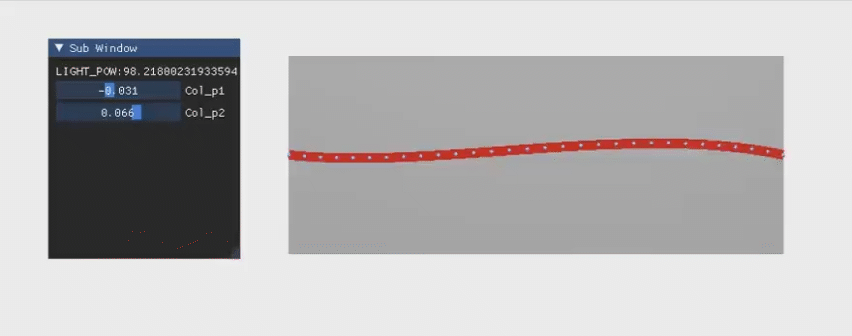
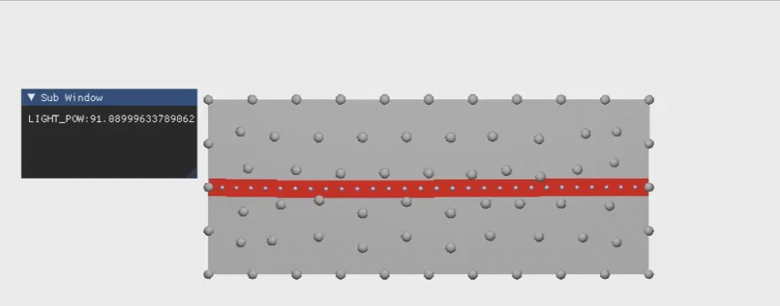

# A Ray Tracing and FEM-based Simulation of Optical Waveguide-based Tactile Sensors

> **Author**: Shao, Qi  
> **Course**: Physics-Based Simulation (Spring 2023)  
> **Instructor**: Prof. Tao Du  
> **Institution**: Tsinghua University  

This repository contains a **2D simulation** project demonstrating the use of **ray tracing** and **finite element methods (FEM)** for modeling optical waveguide-based tactile sensors. The project allows users to visualize and interact with a simulated tactile sensor.


## Dependencies

This project requires the following packages:

- `pygmsh==7.1.17`  
- `taichi==1.5.0`  


## Platform

The project was developed and tested on **Windows 11** with the **CUDA backend** for GPU acceleration.


## Running the Simulation

To run the simulation, use the following command:
```bash
python main.py
```


## Demonstration

1. Demo 1: Shows the adjustment of the optical waveguide shape.  
   

2. Demo 2: Shows real-time interaction with objects generated using the mouse.  
   


## Acknowledgments

This project is based on the knowledge and materials provided in the **Physics-Based Simulation** course, taught by **Prof. Tao Du** at Tsinghua University. The following references and resources were used during development:

- "Ray Tracing from Scratch" by HK-Shao ([link](https://shao.fun/blog/w/taichi-ray-tracing.html))  
- "Lecture 08 of Taichi Graphics Course S1: Elastic Object Simulation 01" by Tiantian Liu ([link](https://github.com/taichiCourse01/--Deformables))  
